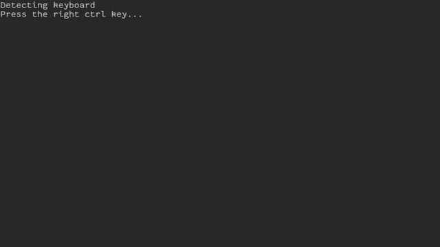

# Asciiroids



Simple space game made with the intention to explore creating a game in a terminal environment and see whether an action
game of some kind could be made.
The engine is very rudimentary with many rough edges that have not been smoothed over, such as the explicit screen to ask
for the player to press a button on the keyboard to detect it.

Game is multiplayer cooperative up to four players.
The game is over when all players have expended all their lives.
Shoot the rocks to get points.
Shoot the aliens for more points.

Seconds of fun for the whole family!

Enjoy :P

## Controls

Player 1: Arrows to move, Right Ctrl to shoot

Player 2: IJKL to move, M to shoot

Player 3: TFGH to move, V to shoot

Player 4: WASD to move, Z to shoot

# Setup

Requires adding user to the `input` group so that they can access the input devices at `/dev/input`.

```sh
sudo usermod -aG input "$USER"
# reboot or logout to refresh
```

# Building

```sh
./build.sh  # debug
# or
./build.sh release  # release
```

# Todo

- [x] Investigate adding a `game` user that is a member of `input` group such that playing the game and getting inputs doesn't require root.
